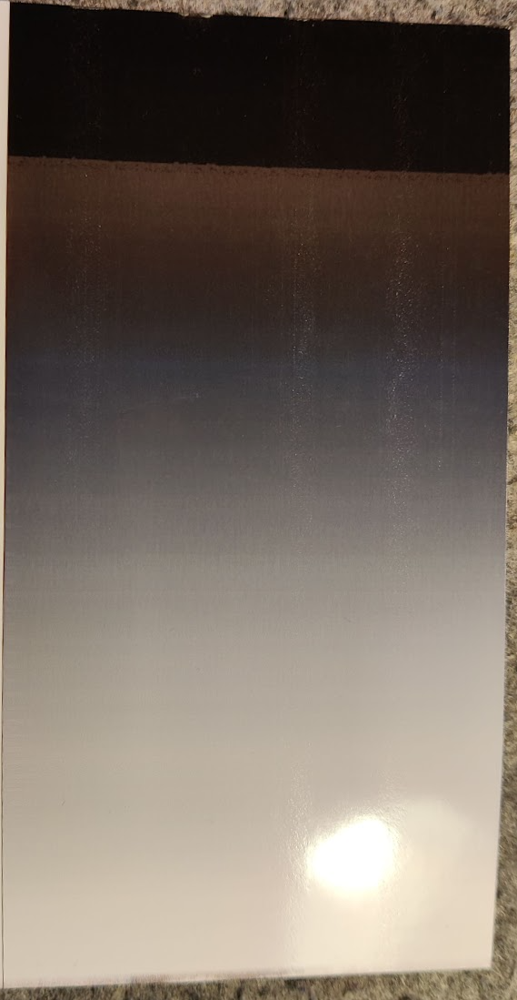
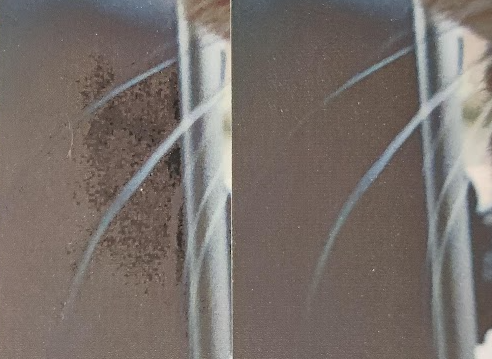
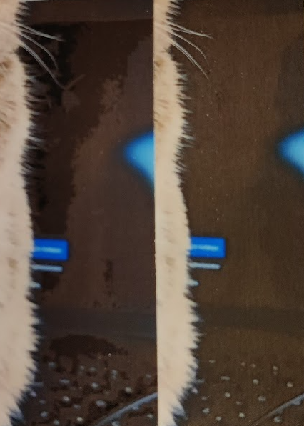

# Brother Black Cleaner

You can try it online: https://relorer.github.io/brother_black_cleaner/

**But I recommend using the desktop version of the program, as js (web version) slightly degrades the quality of the original photo.**

My *Brother* printer prints an uneven black gradient. See the photo below.

This utility replaces pixels with a color intensity below a certain threshold (in my case, 2-3%) with lighter ones. This helps remove artifacts from photos.

Before -> After

My model: brother DCP-T520DW
